<div align="center">
  

  # Mycelium

  *The intelligent substrate beneath your code*
</div>

A meta-workflow orchestration plugin for Claude Code that implements systematic development with compounding knowledge capture. Like a mycelium network that learns, adapts, and grows stronger with each connection, this workflow creates an intelligent knowledge layer that makes every development session more capable than the last.

Inspired by Conductor, Superpowers, and Compound Engineering principles.

## Core Philosophy

> Each unit of work should make subsequent units easier through compounding knowledge and systematic processes.

Like the mycelium network in nature that connects and nourishes an entire forest, this workflow creates an underground intelligence layer that:
- 🍄 **Learns** from patterns across sessions
- 🌐 **Connects** knowledge into a growing network
- 📈 **Compounds** capability with each use
- 🔄 **Adapts** to your development style

## Workflow Overview

```mermaid
flowchart TD
    Start([Session Start]) --> CheckProject{Project<br/>Exists?}

    %% Phase -1: Bootstrap
    CheckProject -->|No| Bootstrap[-1: Project Bootstrap]
    Bootstrap --> Interactive[Interactive Setup<br/>One Question at a Time]
    Interactive --> CreateStructure[Create .mycelium/<br/>Directory Structure]
    CreateStructure --> GitInit[Initialize Git<br/>MANDATORY]
    GitInit --> Phase0

    %% Phase 0: Context Loading
    CheckProject -->|Yes| Phase0[0: Context Loading]
    Phase0 --> LoadContext[Load Project Context<br/>product.md, tech-stack.md]
    LoadContext --> LoadKnowledge[Load Institutional Knowledge<br/>solutions/, learned/]
    LoadKnowledge --> DiscoverCaps[Discover Capabilities<br/>All Plugin Scopes]
    DiscoverCaps --> Phase1

    %% Phase 1: Clarify (Capabilities already discovered in Phase 0)
    Phase1[1: Clarify Request] --> AskQuestions[Ask Clarifying Questions<br/>ONE at a time<br/>⚠️ Capabilities already cached from Phase 0]
    AskQuestions --> RequirementsClear{Requirements<br/>Clear?}
    RequirementsClear -->|No| AskQuestions
    RequirementsClear -->|Yes| Research{Need External<br/>Research?}
    Research -->|Yes| Phase15[1.5: Research]
    Research -->|No| Phase2
    Phase15 --> Phase2[2: Planning & Assignment]
    Phase2 --> LoadCachedCaps[Load Cached Capabilities<br/>from state.json<br/>discovered in Phase 0E]
    LoadCachedCaps --> DecomposeRequest[Decompose User Request<br/>into Features]
    DecomposeRequest --> DecomposeFeatures[Decompose Each Feature<br/>into 2-5 min Tasks]
    DecomposeFeatures --> DefineGitStrategy[Define Git Strategy:<br/>• Feature = git branch<br/>• Multiple features = worktrees]
    DefineGitStrategy --> AssignCaps[Assign to Each Task:<br/>• Best-fit agent from cache<br/>• Relevant skills from cache<br/>• Model tier haiku/sonnet/opus]
    AssignCaps --> VerifyAssign[Verify Assignments Valid<br/>All exist in cached capabilities]
    VerifyAssign --> CheckFeatures{Multiple<br/>Features?}

    %% Phase 3: Implementation - Feature Level
    CheckFeatures -->|Yes| ParallelFeatures[3: Parallel Feature Development<br/>Git Worktrees]
    ParallelFeatures --> CreateWorktrees[Create Worktree Per Feature<br/>.worktrees/feature-name/<br/>branch: feature/name]
    CreateWorktrees --> SpawnFeatureAgents[Spawn Agent Per Feature<br/>Fresh Context Per Worktree]
    SpawnFeatureAgents --> FeatureTasks[Each Agent: Execute Tasks<br/>2-5 min units with TDD]
    FeatureTasks --> Phase45

    CheckFeatures -->|No| SingleFeature[3: Single Feature Development<br/>Git Branch Only]
    SingleFeature --> CreateBranch[Create Feature Branch<br/>git checkout -b feature/name]
    CreateBranch --> ExecuteTasks[Execute Tasks Sequentially<br/>2-5 min units with TDD]
    ExecuteTasks --> Phase45

    %% Phase 4.5: Verification
    Phase45[4.5: Verification] --> EvidenceCheck[Evidence-Based Check<br/>NO 'should work']
    EvidenceCheck --> RunTests[Run All Tests]
    RunTests --> Coverage[Check Coverage ≥80%]
    Coverage --> Lint[Run Linters]
    Lint --> Build[Verify Build]
    Build --> ContextCheck{Context<br/>>80%?}

    %% Phase 4.5B: Context Management
    ContextCheck -->|Yes| Phase45B[4.5B: Context Sync]
    Phase45B --> Summarize[Summarize Work<br/>≤500 tokens]
    Summarize --> UpdateProgress[Update progress.md]
    UpdateProgress --> SpawnFresh[Spawn Fresh Agent<br/>with Compressed Context]
    SpawnFresh --> Phase5
    ContextCheck -->|No| Phase5

    %% Phase 5: Two-Stage Review
    Phase5[5: Review] --> Stage1[Stage 1: Spec Compliance]
    Stage1 --> SpecCheck{Meets All<br/>Requirements?}
    SpecCheck -->|No| FixSpec[Fix Missing Requirements]
    FixSpec --> Phase4
    SpecCheck -->|Yes| Stage2[Stage 2: Code Quality Review<br/>Parallel Multi-Agent]
    Stage2 --> Security[Security Analysis<br/>OWASP + AI-specific]
    Stage2 --> Performance[Performance Analysis<br/>Algorithms + Bottlenecks]
    Stage2 --> Architecture[Architecture Review<br/>Patterns + Design]
    Security --> CombineReview[Combine Reviews]
    Performance --> CombineReview
    Architecture --> CombineReview
    CombineReview --> CriticalIssues{Critical<br/>Issues?}
    CriticalIssues -->|Yes| FixIssues[Fix Critical Issues]
    FixIssues --> Phase4
    CriticalIssues -->|No| Phase6

    %% Phase 6: Knowledge Capture
    Phase6[6: Finalization] --> Commit[Git Commit<br/>with Co-Author]
    Commit --> CreatePR[Create Pull Request<br/>MCP or CLI]
    CreatePR --> Phase6E[6E: Pattern Detection]
    Phase6E --> DetectPatterns[Detect 3+ Similar Solutions]
    DetectPatterns --> PromotePattern{Pattern<br/>Found?}
    PromotePattern -->|Yes| UpdateCritical[Update critical-patterns.md]
    UpdateCritical --> Phase6ESkill
    PromotePattern -->|No| Phase6F
    Phase6ESkill{Generate<br/>Skill?}
    Phase6ESkill -->|Yes| GenSkill[Auto-Generate Skill<br/>from Pattern]
    GenSkill --> Phase6F
    Phase6ESkill -->|No| Phase6F

    Phase6F[6F: Store Learned Knowledge] --> CaptureSolution[Capture Solution<br/>with YAML Validation]
    CaptureSolution --> CaptureDecision[Capture Decisions<br/>.mycelium/learned/decisions/]
    CaptureDecision --> CaptureConvention[Detect Conventions<br/>.mycelium/learned/conventions/]
    CaptureConvention --> UpdatePrefs[Update Preferences<br/>.mycelium/learned/preferences.yaml]
    UpdatePrefs --> TrackAntiPattern[Track Anti-Patterns<br/>.mycelium/learned/anti-patterns/]
    TrackAntiPattern --> RecordPrompt[Record Effective Prompts<br/>.mycelium/learned/effective-prompts/]
    RecordPrompt --> UpdateMetrics[Update Session Metrics]
    UpdateMetrics --> Done([Work Complete])

    %% Feedback Loops
    Done -.->|Knowledge<br/>Compounds| Phase0
    UpdateCritical -.->|Pattern<br/>→ Skill| Phase0
    RecordPrompt -.->|Learning<br/>→ Better Work| Phase4

    %% Styling
    classDef bootstrap fill:#e1f5ff,stroke:#01579b,stroke-width:2px
    classDef context fill:#fff9c4,stroke:#f57f17,stroke-width:2px
    classDef planning fill:#f3e5f5,stroke:#4a148c,stroke-width:2px
    classDef implementation fill:#e8f5e9,stroke:#1b5e20,stroke-width:2px
    classDef verification fill:#fff3e0,stroke:#e65100,stroke-width:2px
    classDef review fill:#fce4ec,stroke:#880e4f,stroke-width:2px
    classDef finalization fill:#e0f2f1,stroke:#004d40,stroke-width:2px
    classDef decision fill:#fff,stroke:#666,stroke-width:2px,stroke-dasharray: 5 5

    class Bootstrap,Interactive,CreateStructure,GitInit bootstrap
    class Phase0,LoadContext,LoadKnowledge,DiscoverCaps context
    class Phase1,Analyze,Phase15,Phase2,LoadCachedCaps,DecomposeRequest,DecomposeFeatures,DefineGitStrategy,CreatePlan,AssignCaps,VerifyAssign planning
    class ParallelFeatures,CreateWorktrees,SpawnFeatureAgents,FeatureTasks,SingleFeature,CreateBranch,ExecuteTasks implementation
    class Phase45,EvidenceCheck,RunTests,Coverage,Lint,Build,Phase45B,Summarize,UpdateProgress,SpawnFresh verification
    class Phase5,Stage1,Stage2,Security,Performance,Architecture,CombineReview,FixSpec,FixIssues review
    class Phase6,Commit,CreatePR,Phase6E,DetectPatterns,UpdateCritical,GenSkill,Phase6F,CaptureSolution,CaptureDecision,CaptureConvention,UpdatePrefs,TrackAntiPattern,RecordPrompt,UpdateMetrics finalization
    class CheckProject,Research,CheckFeatures,ContextCheck,SpecCheck,CriticalIssues,PromotePattern,Phase6ESkill decision
```



**Key Features:**
- 🔄 **Feedback Loops**: Knowledge compounds across sessions
- ⚡ **Parallel Execution**: Default mode with dependency management
- 🧪 **Iron Law TDD**: 11-step test-first cycle enforced
- 🎯 **Evidence-Based**: No "should work" - only verified proof
- 🧠 **Context Management**: Auto-sync at 80% threshold
- 📚 **Knowledge Capture**: Solutions → Patterns → Skills

## Features

### 🎯 Comprehensive Workflow Phases

- **Phase -1: Project Bootstrap** - Initialize projects with .mycelium/ structure
- **Phase 0: Context Loading** - Load institutional knowledge + discover capabilities (cached)
- **Phase 1: Clarify Request** - Ask clarifying questions, define scope
- **Phase 2: Planning & Assignment** - Decompose request → features → 2-5 min tasks, assign capabilities
- **Phase 3: Feature Development** - Parallel features via worktrees OR single feature via branch
- **Phase 4.5: Verification** - Evidence-based testing (no "should work" claims)
- **Phase 5: Review** - Two-stage review (spec compliance + code quality)
- **Phase 6: Finalization** - Knowledge capture with feedback loops

### 🌳 Hierarchical Decomposition

**Request → Features → Tasks**

```
User Request: "Add user authentication"
  ↓
Features (user-facing capabilities):
  • Feature 1: OAuth Integration → branch: feature/oauth-integration
  • Feature 2: Login UI → branch: feature/login-ui
  • Feature 3: Session Management → branch: feature/session-mgmt
  ↓
Tasks (2-5 min atomic units):
  Feature 1 tasks: [1.1 Google OAuth, 1.2 GitHub OAuth, 1.3 Token storage]
  Feature 2 tasks: [2.1 Login form, 2.2 Logout button, 2.3 User profile]
  Feature 3 tasks: [3.1 Session storage, 3.2 Token refresh, 3.3 Logout]
```

**Git Strategy:**
- **One feature** → `git checkout -b feature/name`
- **Multiple features** → Git worktrees in `.worktrees/` directory

**Worktree Storage:**
```
project-root/
├── .worktrees/              # Git worktrees (gitignored)
│   ├── feature-oauth/       # Feature 1 worktree + branch
│   ├── feature-login-ui/    # Feature 2 worktree + branch
│   └── feature-session/     # Feature 3 worktree + branch
├── .mycelium/               # Workflow metadata
├── .gitignore               # Includes .worktrees/
└── src/                     # Main source
```

**Commands:**
```bash
# Create worktree for each feature
git worktree add .worktrees/feature-oauth -b feature/oauth-integration
git worktree add .worktrees/feature-login-ui -b feature/login-ui
git worktree add .worktrees/feature-session -b feature/session-mgmt

# Each agent works in its own worktree
cd .worktrees/feature-oauth && [agent executes tasks]
cd .worktrees/feature-login-ui && [agent executes tasks]
cd .worktrees/feature-session && [agent executes tasks]

# Cleanup after merge
git worktree remove .worktrees/feature-oauth
```

### 📚 Knowledge Compounding System

**Solutions Library (`.mycelium/solutions/`):**
- Pattern-based knowledge capture
- Automatic promotion (3+ occurrences → critical-patterns.md)
- Searchable by problem type and tags

**Learning Store (`.mycelium/learned/`):**
- `decisions/` - Architectural decisions with context
- `conventions/` - Detected code patterns
- `preferences.yaml` - User preferences learned from corrections
- `anti-patterns/` - Mistakes to avoid
- `effective-prompts/` - Approaches that worked

### 🔄 Feedback Loops

- **Pattern → Skill**: Auto-generate skills from recurring patterns
- **Work → Knowledge**: Capture solutions, decisions, conventions
- **Context → Discovery**: Auto-discover capabilities from all plugin scopes
- **Corrections → Learning**: Learn preferences from user feedback

### ⚡ Parallel Execution (Default)

- Git worktrees for isolated parallel tasks
- Dependency management (blockedBy/blocks)
- Task scheduler with DAG resolution
- Model tier selection (haiku/sonnet/opus)

### 🧠 Context Window Management

- Phase 4.5B: Automatic context sync
- Progress files bridge context between sessions
- Fresh agent spawning when context > 80%
- Checkpoint-based resumption

## Installation

### From Local Directory

```bash
# Test locally
claude-code --plugin-dir /path/to/mycelium

# Or symlink to project plugins
ln -s /path/to/mycelium /path/to/project/.claude/plugins/mycelium
```

### From Git Repository

```bash
# Clone to user plugins directory
git clone https://github.com/jason-hchsieh/mycelium ~/.claude/plugins/mycelium
```

## Quick Start

### 1. Initialize a Project

```bash
/mycelium-setup
```

This creates the `.mycelium/` directory structure:
```
.mycelium/
├── context/           # Project information
│   ├── product.md
│   ├── tech-stack.md
│   └── workflow.md
├── plans/             # Implementation plans
├── solutions/         # Documented solutions
│   └── patterns/
│       └── critical-patterns.md
├── learned/           # Learning store
│   ├── decisions/
│   ├── conventions/
│   ├── preferences.yaml
│   ├── anti-patterns/
│   └── effective-prompts/
├── state.json         # Session state
└── progress.md        # Human-readable progress
```

### 2. Create an Implementation Plan

```bash
/mycelium-plan "Add user authentication"
```

Creates a detailed plan with:
- Task breakdown with complexity estimates
- Dependency relationships (blockedBy/blocks)
- Agent, skill, and model assignments
- Acceptance criteria for each task
- Test strategy

### 3. Execute the Plan

```bash
/mycelium-work
```

Executes tasks with:
- Parallel worktree execution (default)
- Iron Law TDD enforcement
- Evidence-based verification
- Automatic context sync

### 4. Review Implementation

```bash
/mycelium-review
```

Two-stage review:
- **Stage 1**: Spec compliance (blocking gate)
- **Stage 2**: Code quality (security, performance, architecture)

### 5. Capture Knowledge

```bash
/mycelium-capture
```

Captures:
- Solutions with validated YAML frontmatter
- Architectural decisions
- Code conventions
- Patterns (promotes to critical-patterns.md after 3+)
- Generates skills from recurring patterns

## Skill Reference

### Primary Skills

| Skill | Description | Interaction |
|-------|-------------|-------------|
| **`/mycelium-go [task] [--interactive]`** | **Full autonomous workflow** (plan → work → review → capture) | Minimal (autonomous) or phase approvals (interactive) |
| `/mycelium-setup [--resume]` | Bootstrap project with mycelium structure | Interactive setup questions |
| `/mycelium-plan [description]` | Create implementation plan with TDD task breakdown | Clarifying questions |
| `/mycelium-work [task_id\|all]` | Execute tasks with strict TDD enforcement | Autonomous with progress updates |
| `/mycelium-review [--stage=1\|2\|all]` | Two-stage review (spec compliance + quality) | Report with decision point |
| `/mycelium-capture [track_id]` | Extract learnings and grow knowledge layer | Autonomous knowledge capture |

### Utility Skills

| Skill | Description |
|-------|-------------|
| `/mycelium-view [task\|track_id] [--verbose]` | Preview workflow plan without execution (dry-run mode with optional workflow diagram) |
| `/mycelium-status [--verbose]` | Display current progress and state |
| `/mycelium-continue [--full] [--track <id>]` | Resume interrupted work from checkpoint |

### Usage Patterns

**🚀 Quick Start (Autonomous)**
```bash
/mycelium-go "Add user authentication with JWT"
# Runs full workflow with minimal interaction
```

**🎯 Controlled (Interactive)**
```bash
/mycelium-go "Add user login" --interactive
# Asks for approval after each phase
```

**🔧 Manual (Step-by-Step)**
```bash
/mycelium-plan "Add user login"
/mycelium-work all
/mycelium-review
/mycelium-capture
# Full control over each phase
```

### Architecture

All user-facing skills are **thin wrappers** (~20-60 lines each) that delegate to internal implementation skills. Other operations (worktrees, PR creation, context sync) are **handled automatically** by skills when needed.

## Skills

All plugin functionality is implemented as skills (following the [Agent Skills standard](https://agentskills.io)):

### User-Facing Skills (slash commands)

| Skill | Purpose |
|-------|---------|
| **go** | Full autonomous workflow (plan → work → review → capture) |
| **plan** | Create implementation plan with TDD task breakdown |
| **work** | Execute tasks with strict TDD enforcement |
| **review** | Two-stage review (spec compliance + quality) |
| **capture** | Extract learnings and grow knowledge layer |
| **view** | Preview workflow plan without execution (supports `--verbose` for diagram) |
| **continue** | Resume interrupted workflow from checkpoint (supports `--track` to switch plans) |
| **status** | Display current progress and state |
| **setup** | Bootstrap project with mycelium structure |

### Internal Skills (Claude-only, `user-invocable: false`)

| Skill | Purpose | Used By |
|-------|---------|---------|
| **tdd** | Iron Law TDD - RED → GREEN → REFACTOR enforcement | `mycelium-work`, `mycelium-go` |
| **verification** | Evidence-based validation (show actual test output) | `mycelium-work`, `mycelium-go` |
| **context** | Project context loading and management | All skills |
| **recovery** | Handle blockers and stuck states | As needed |

### Skill Architecture

User-facing skills contain full workflow logic directly:
- **`mycelium-go`** contains the complete autonomous orchestration engine (plan → work → review → capture)
- **`mycelium-plan`**, **`mycelium-setup`**, **`mycelium-capture`** contain their complete workflow logic (no wrapper pattern)
- **Internal skills** (tdd, verification, context, recovery): Provide reusable domain expertise
- **Benefit**: Each user-facing skill is self-contained and can be invoked independently

## Agents

3 specialized agents for workflow tasks:

| Agent | Purpose | Tools |
|-------|---------|-------|
| **spec-compliance-reviewer** | Verify implementation matches requirements | Read, Grep, Glob, Bash |
| **code-quality-reviewer** | Assess security, performance, architecture | Read, Grep, Glob, Bash |
| **learning-agent** | Capture and analyze institutional knowledge | Read, Write, Grep, Glob, Bash |

## Hooks

- **SessionStart**: Load project context + discover capabilities
- **Stop**: Save session state

## Configuration

### Project-Level (`.mycelium/context/`)

**product.md** - Product vision and goals
**tech-stack.md** - Technical stack details
**workflow.md** - Development practices

### Session State (`.mycelium/state.json`)

Tracks:
- Current session ID and timestamps
- Active tracks and worktrees
- Discovered capabilities (agents, skills, MCPs)
- Metrics (tasks completed/failed, context resets, interventions)

## Project Maturity Modes

Configure in `.mycelium/context/workflow.md`:

| Mode | TDD | Coverage | Review | Use Case |
|------|-----|----------|--------|----------|
| **prototype** | flexible | 50% | minimal | Rapid experimentation |
| **development** | standard | 80% | full | Active development |
| **production** | strict | 90% | full | Production code |
| **regulated** | strict | 95% | full + compliance | Regulated industries |

## Task Complexity Classification

Beyond simple T/S/M/L sizing:

```yaml
complexity: M
integration_points: 2
domain_novelty: partially_known
test_complexity: integration
reversibility: requires_migration
uncertainty: medium
```

## Dependency Management

Enable parallel execution:

```yaml
Task 1.1: Setup database
  blockedBy: []
  blocks: [1.2, 1.3]

Task 1.2: User model
  blockedBy: [1.1]
  blocks: [2.1]
```

Plugin manages execution order automatically.

## Model Tier Selection

```yaml
# Per-task model assignment
Task 1.1: Database schema
  model: opus      # Complex architecture

Task 1.2: CRUD endpoints
  model: sonnet    # Standard implementation (default)

Task 1.3: Code review
  model: haiku     # Fast, cheap
```

## External Plugin Integration

Works with these external plugins (optional):

| Plugin | Provides | Fallback |
|--------|----------|----------|
| **github** | github-mcp, GitHub skills | gh CLI |
| **gitlab** | gitlab-mcp, GitLab skills | glab CLI |
| **gitea** | gitea-mcp, Gitea skills | tea CLI |
| **commit-commands** | /commit, /commit-push-pr | git commands |

## Directory Structure

```
mycelium/
├── .claude-plugin/
│   └── plugin.json           # Plugin manifest
├── agents/
│   ├── review/
│   │   ├── spec-compliance.md
│   │   └── code-quality.md
│   └── learning-agent.md
├── skills/
│   ├── mycelium-go/          # User-facing: full autonomous workflow
│   ├── mycelium-plan/        # User-facing: create implementation plan
│   ├── mycelium-work/        # User-facing: execute tasks with TDD
│   ├── mycelium-review/      # User-facing: two-stage code review
│   ├── mycelium-capture/     # User-facing: extract learnings
│   ├── mycelium-continue/    # User-facing: resume interrupted workflow
│   ├── mycelium-status/      # User-facing: display progress
│   ├── mycelium-setup/       # User-facing: bootstrap project
│   ├── tdd/                  # Internal: TDD enforcement
│   ├── verification/         # Internal: evidence-based validation
│   ├── context/              # Internal: context window management
│   └── recovery/             # Internal: recovery protocols
├── hooks/
│   ├── hooks.json
│   └── scripts/
│       ├── session-start.sh
│       └── save-state.sh
├── templates/                # 13 template files
│   ├── project/              # Project setup templates (5 files)
│   │   ├── product.md.template
│   │   ├── tech-stack.md.template
│   │   ├── workflow.md.template
│   │   ├── CLAUDE.md.template
│   │   └── critical-patterns.md.template
│   ├── plans/
│   │   └── plan.md.template
│   ├── solutions/
│   │   └── solution.md.template
│   ├── state/
│   │   └── progress.md.template
│   └── gitignore/            # Language-specific .gitignore (4 files)
│       ├── node.gitignore
│       ├── python.gitignore
│       ├── go.gitignore
│       └── rust.gitignore
├── schemas/                  # 7 JSON schemas
│   ├── session-state.schema.json
│   ├── solution-frontmatter.schema.json
│   ├── plan-frontmatter.schema.json
│   ├── enums.json
│   └── ...
└── lib/                      # 13 utility modules
    ├── schema-validator.js   # Core infrastructure
    ├── state-manager.js
    ├── template-renderer.js
    ├── pattern-detector.js
    ├── discovery/            # Capability discovery (5 utilities)
    │   ├── capability-scanner.js
    │   ├── agent-discovery.js
    │   ├── skill-discovery.js
    │   ├── mcp-discovery.js
    │   └── cache-manager.js
    └── scheduler/            # Scheduling algorithms (4 utilities)
        ├── task-scheduler.js
        ├── dependency-graph.js
        ├── worktree-tracker.js    # State tracking only
        └── merge-analyzer.js       # Conflict analysis only

**Note:** The lib/ utilities follow "infrastructure-only" principle:
- **Removed**: Learning operations (now AI-powered via learning-agent)
- **Removed**: Agent spawning (now uses Task tool natively)
- **Kept**: Programmatic infrastructure (validation, discovery, scheduling algorithms)
- **Philosophy**: lib/ provides data structures/algorithms, not orchestration
```

## Best Practices

### 1. Always Use TDD
Tests first, implementation second. No exceptions.

### 2. Document Solutions
Every non-trivial fix should be captured in `.mycelium/solutions/`.

### 3. Plan Before Implementing
Use `/mycelium-plan` to break down work systematically.

### 4. Leverage Parallelism
Design tasks with minimal dependencies for maximum parallelism.

### 5. Track Deviations
Update plans when requirements change, log reasons in deviations section.

### 6. Review Comprehensively
Use two-stage review: spec compliance first, code quality second.

### 7. Capture Knowledge
Run `/mycelium-capture` after completing work to build institutional knowledge.

## Troubleshooting

### "No .mycelium directory found"
Run `/mycelium-setup` to initialize the project.

### "Cannot create worktree"
Ensure you're in a git repository and the branch doesn't already have a worktree.

### "Tests not found"
Check test paths in your project configuration and ensure test framework is installed.

### "Pattern detection not working"
Ensure solution files have proper YAML frontmatter with tags. Patterns detected at 3+ occurrences.

## Development

### Running Tests

```bash
# Unit tests
npm test

# Integration tests
npm run test:integration

# Coverage
npm run coverage
```

### Contributing

1. Fork the repository
2. Create a feature branch
3. Follow the Iron Law TDD
4. Run `/mycelium-review` before submitting
5. Document solutions in PR description
6. Submit pull request

## License

MIT

## Credits

Inspired by:
- **Conductor** - Workflow orchestration patterns
- **Superpowers** - Knowledge compounding principles
- **Compound Engineering** - Systematic improvement methodology

Built for **Claude Code** by Anthropic.

## Support

- Issues: [GitHub Issues](https://github.com/jason-hchsieh/mycelium/issues)
- Discussions: [GitHub Discussions](https://github.com/jason-hchsieh/mycelium/discussions)
- Documentation: This README and inline documentation

## Version

See `plugin.json` for current version. Uses [semantic versioning](https://semver.org/).
